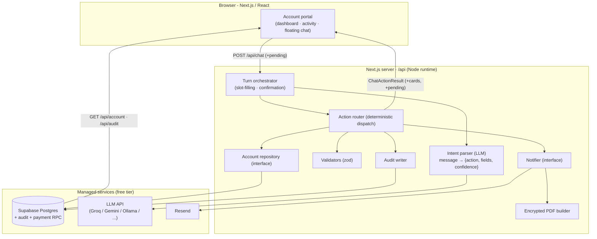

# Architecture Diagram

High-level architecture of the account self-service chatbot. Detailed HLD/LLD
diagrams (system, request pipeline, sequence, ER model) are in
[docs/diagrams](./docs/diagrams).

**Core principle:** free customer text enters the parser, but only
deterministic, validated code ever writes to the database or sends email - the
LLM classifies, it never acts.

## Request lifecycle

`message → parse (LLM) → route → validate → execute → persist → notify → audit → structured reply`

- **Reads** return early with no side effects.
- **Writes** must pass validation; **money/destructive actions require an
  explicit confirmation**; missing details trigger multi-turn slot-filling.
- On any data change, a generic email is sent with sensitive detail in an
  **encrypted PDF**, and a before/after row is written to `account_change_events`.
