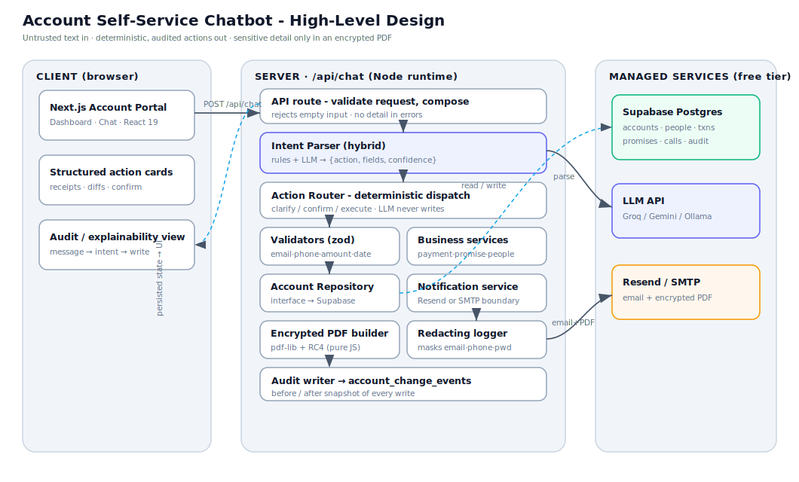
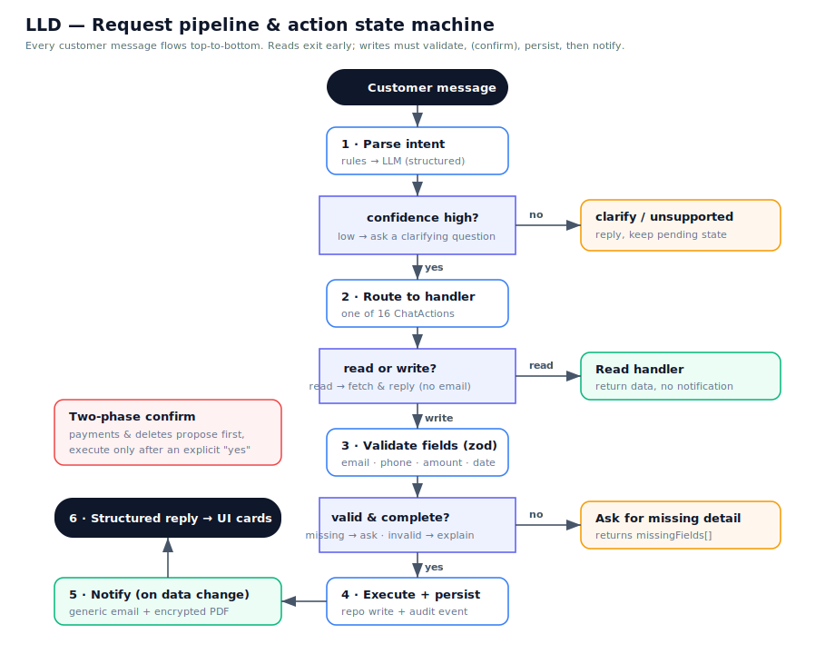
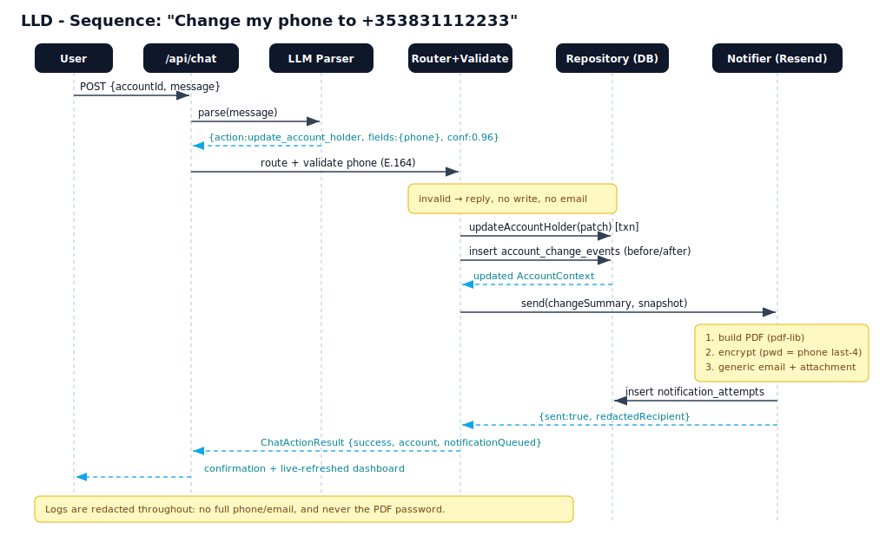

# Architecture Diagrams

Structured HLD/LLD diagrams for the account self-service chatbot. All are plain
SVG (no build step) and render directly on GitHub.

**Why these diagrams exist:** the challenge is about turning messy customer
messages into safe, persisted actions. These diagrams make the two things a
reviewer cares about obvious at a glance: (1) the one-directional trust boundary
(the LLM only classifies, deterministic code does every write), and (2) how a
single message flows through parse, validate, execute, notify, and audit.

## HLD - System architecture

Three lanes: browser client, the Next.js server pipeline, and managed services
(Supabase, an LLM provider, and email). The point of this view is the trust
boundary: free customer text enters the parser, but only validated, deterministic
code ever writes to the database or sends email. Email can go through Resend or
any SMTP provider; the LLM is any OpenAI-compatible endpoint (Groq/Gemini/Ollama).

## LLD - Request pipeline and action state machine

How one message travels top to bottom. Reads exit early with no side effects;
writes must pass validation, and money or destructive actions require an explicit
confirmation, before anything persists and a notification is sent. This is where
the safety rules (confirm before paying, ask for missing details) are visible.

## LLD - Sequence: update phone number

An end-to-end mutating action, showing the audit-event write and the
build/encrypt/send notification steps. Logs are redacted at every hop. It is a
concrete example of the pipeline above for one representative action.

## LLD - Data model (ERD)

The seven starter tables plus the additions that matter: `account_change_events`
(before/after audit trail powering the Activity view and undo) and a unique
`idempotency_key` on `transactions` (so a retried payment cannot double-charge).
Conversation state (slot-filling / confirmation / receipt-email memory) is
deliberately carried by the client each turn rather than stored, which keeps the
API functions stateless - so there is no conversations table.

## What changed as the build progressed

The diagrams reflect the current system, including additions made after the
first draft: a turn orchestrator for multi-turn slot-filling and two-phase
confirmation, client-carried session memory (receipt email), an audit-powered
undo, an SMTP notifier alongside Resend (to email any recipient), and
provider-agnostic LLM parsing.
